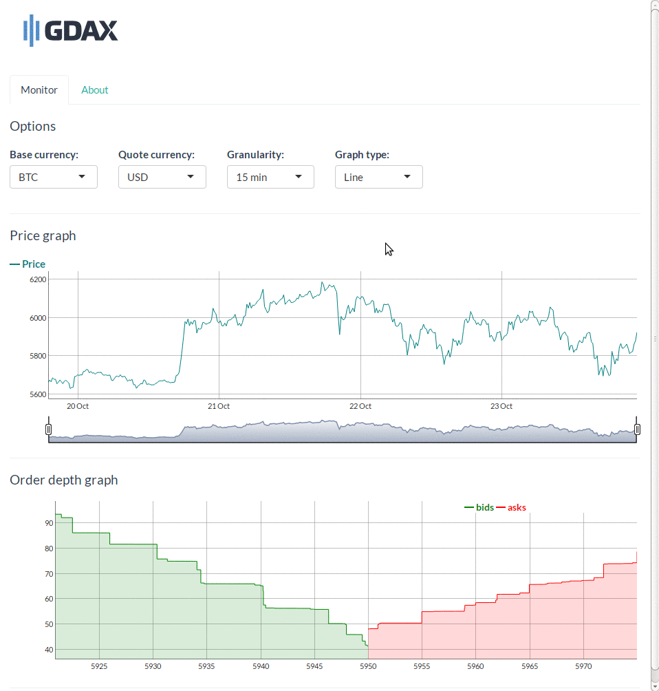

# Shiny-GDAX
The Global Digital Asset Exchange ([GDAX](https://www.gdax.com/)) is a regulated
U.S. based exchange service for institutions and professional traders offering
digital currencies like Bitcoin, Ethereum and Litecoin for fiat currency.  
Shiny-GDAX is an interactive market visualization tool for GDAX built using the
[GDAX API](https://docs.gdax.com/) and the [Shiny](https://shiny.rstudio.com/)
R package.  
  

## Prerequisites
The following R packages are required to run Shiny-GDAX:  
* `httr`
* `jsonlite`
* `shiny`
* `shinythemes`
* `dygraphs`
* `xts`

Only the first two packages are required to use the R GDAX API wrappers.

## Running the application
Shiny-GDAX is launched by running `app.R` with Shiny's `runApp` procedure:  
```sh
$ Rscript -e "shiny::runApp('app.R')"
```
Alternatively, the application can be launched by running `app.R` from RStudio.

## Todos
* Websocket client
* Authenticated client
* Live price updates with websockets
* Trading interface
* Technical analysis indicators

## Built with
* [shiny](https://cran.r-project.org/package=shiny) - Web application
framework for R
* [dygraphs](https://cran.r-project.org/package=dygraphs) - Interactive time
series charting library
